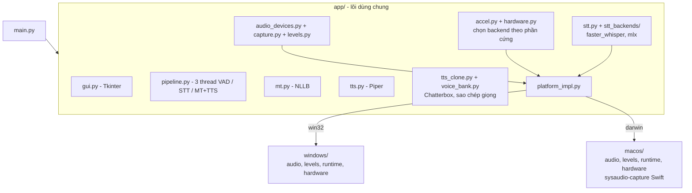
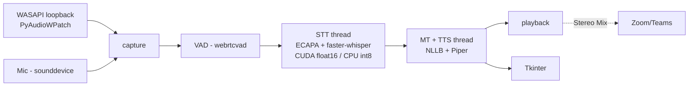
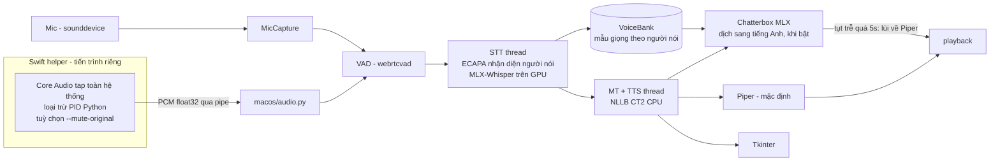

# Kiến trúc Windows vs macOS

Cập nhật: 2026-09-25, nhánh `macos`. Máy đo: MacBook M2 Pro 32GB, macOS 26.6.

Tài liệu này mô tả kiến trúc hiện tại, so sánh hai nền tảng, và ghi lại **số đo thật**
dẫn tới từng quyết định. Mỗi mục gắn nhãn:

- **[đã đo]** đo trên máy thật, có script trong `evals/` hoặc `macos/bench/`
- **[chưa kiểm chứng]** đã viết code hoặc có giả thuyết, chưa chạy thật
- **[để sau]** chủ đích chưa làm

---

## 0. Trạng thái nhanh

| Hạng mục | Windows | macOS |
|---|---|---|
| Chạy được | Chạy trước khi refactor, **chưa chạy lại sau khi tách `windows/`** | Chạy: tự kiểm tra 10/10, giao diện dịch được video thật |
| Bắt âm thanh hệ thống | WASAPI loopback | Core Audio tap qua helper Swift **[đã đo]** |
| STT | faster-whisper (CUDA/CPU) | MLX-Whisper trên GPU Apple (`large-v3-turbo`) **[đã đo]** |
| Dịch | NLLB CTranslate2 | NLLB CTranslate2 (CPU int8) |
| Đọc | Piper | Piper; tuỳ chọn Chatterbox sao chép giọng **[chưa kiểm chứng ngoài bài kiểm tra ngoại tuyến]** |
| Tắt tiếng gốc khi dịch | Không hỗ trợ | Đã sửa sang `.muted`, **[chưa kiểm chứng]** (xem mục 7) |
| CUDA, Intel NPU | Giữ hành vi cũ | Không áp dụng |

---

## 1. Kiến trúc chung: lõi dùng chung + adapter theo nền tảng

`app/` là lõi dùng chung. `windows/` và `macos/` ngang hàng, mỗi bên cung cấp cùng một
bộ module; lõi chỉ đi qua `app/platform_impl.py`, không bao giờ import trực tiếp nền tảng.



Giao diện mỗi gói nền tảng phải cung cấp:

| Module | Nội dung |
|---|---|
| `audio` | `HOST_APIS`, `GENERIC_ALIASES`, `PREFER_DEFAULT_OUTPUT`, `SUPPORTS_MUTE_ORIGINAL`, `VIRTUAL_MIC_*`, `list_loopback_devices`, `get_default_loopback_device`, `is_same_physical_device`, `LoopbackCapture` |
| `levels` | `find_active_loopback`, `main` |
| `runtime` | `ensure_cuda_dlls` (macOS: không làm gì) |
| `hardware` | `detect_accelerators`, `total_ram_gb` |

Thêm nền tảng hoặc bộ tăng tốc mới chỉ cần thêm gói/backend, không sửa lõi.

### Cấu trúc thư mục

```
main.py, setup_env.py, requirements-common.txt
app/                      lõi dùng chung
  platform_impl.py        chọn windows/ hoặc macos/ theo sys.platform
  audio_types.py          LoopbackDevice / InputDevice / OutputDevice
  audio_devices.py        mic + thiết bị phát (sounddevice); loopback ủy quyền cho nền tảng
  capture.py              MicCapture + LoopbackCapture (từ nền tảng)
  accel.py                Accelerator + chính sách chọn backend/model theo phần cứng
  hardware.py             HardwareProfile
  stt.py                  bộ lọc ảo giác + đoán ngôn ngữ (dùng chung)
  stt_backends/           faster_whisper.py | mlx.py
  voice_bank.py           kho mẫu giọng theo người nói
  tts_clone.py            Chatterbox (mlx-audio), luồng riêng, cache điều kiện giọng
windows/                  audio.py (WASAPI), levels.py, runtime.py, hardware.py,
                          cuda_setup.py, CHAY_APP.bat, requirements.txt
macos/                    audio.py (Core Audio tap), levels.py, runtime.py, hardware.py,
                          sysaudio-capture/ (Swift), build_helper.sh, setup_mac.sh,
                          run.command, bench/, requirements.txt
evals/                    bộ đo độ trễ, độ chính xác, sao chép giọng (xem evals/README.md)
docs/
```

---

## 2. Windows (không đổi hành vi)



- Chống vòng lặp: tự tắt thu khi đang đọc, chọn output khác card với thiết bị loopback.
- Chiều Việt→Anh vào Zoom qua Stereo Mix, chỉ nghe được chính card của nó.
- Sau refactor, code Windows đã chuyển sang `windows/` nhưng **chưa được chạy lại trên máy Windows**.

## 3. macOS



Điểm khác Windows:
- Bắt âm thanh nằm **ngoài tiến trình Python** (Swift), vì Python không có API sạch cho Core Audio tap.
- Helper **loại trừ tiến trình Python** khỏi tap, nên bản dịch phát ra không bị bắt lại (cần xác nhận ngoài thực tế, xem mục 7).
- Không có Stereo Mix; chiều Việt→Anh vào Zoom cần mic ảo BlackHole.

---

## 4. So sánh thành phần

| Thành phần | Windows | macOS | Mức khác |
|---|---|---|---|
| Bắt âm thanh hệ thống | WASAPI loopback | Core Audio tap (Swift) | Viết mới |
| Chống vòng lặp | Tách card, tự tắt thu khi đọc | Loại trừ PID khỏi tap | Đổi cơ chế |
| Tắt tiếng gốc | Không | `--mute-original` (`.muted`) | Chỉ macOS |
| Thiết bị | Lọc WASAPI/DirectSound, ghép card | CoreAudio qua sounddevice | Viết lại |
| Mic ảo | Stereo Mix | BlackHole | Đổi |
| VAD | webrtcvad-wheels | webrtcvad-wheels (có wheel arm64) | Giữ |
| STT | faster-whisper CUDA/CPU | MLX-Whisper (Metal) | Thêm backend |
| Nhận diện người nói | ECAPA (torch) | ECAPA (torch CPU) | Giữ |
| Dịch | NLLB CT2 (GPU) | NLLB CT2 CPU int8 | Giữ |
| TTS | Piper | Piper + Chatterbox (tuỳ chọn) | Thêm |
| Cắt câu, glossary, lọc ảo giác | Thuần Python | Như cũ | Giữ |
| Cài đặt | `windows/CHAY_APP.bat` | `macos/setup_mac.sh`, `macos/run.command` | Viết mới |
| Quyền | Không cần admin | "Ghi âm thanh hệ thống" cho ứng dụng chạy app | Mới |

---

## 5. Tăng tốc phần cứng và số đo

Mỗi giai đoạn chọn bộ tăng tốc riêng (`app/accel.py`). Windows giữ CUDA hoặc CPU; Intel NPU và Neural Engine [để sau].

### 5.1 Nhận diện giọng nói (STT) [đã đo]

Âm thanh sạch (giọng tổng hợp), câu 4,6–5,1s, MLX trên GPU M2 Pro:

| Model | Suy luận | Đoán ngôn ngữ | Ghi chú |
|---|---|---|---|
| small | 0,2s | 0,1s | Sai dấu tiếng Việt nhiều |
| medium | 0,5–0,6s | 0,3s | |
| **large-v3-turbo** | 0,6s | 0,55s | Mặc định cho Mac từ 16GB RAM |

Giọng thật, chế độ tự nhận diện (`evals/replay.py`, video mẫu 16 phút, 164 câu ~7,7s): STT trung vị **1,2s/câu**
(RTF 0,21), gồm ~0,55s đoán ngôn ngữ. Dịch NLLB trung vị 0,33s, p95 0,86s.

**Độ chính xác tiếng Việt** (`evals/wer_fleurs.py`, FLEURS tập dev, 361 câu, giọng đọc sạch, toàn giọng nam):

| Model | WER | CER | Mỗi câu | Chạy trên |
|---|---|---|---|---|
| Zipformer-vi 30M int8 (sherpa-onnx) | 8,3% | 5,5% | 91ms | CPU |
| Whisper small (MLX) | 25,6% | 12,9% | 344ms | GPU |
| Whisper large-v3-turbo (MLX) | 8,4% | 4,2% | 789ms | GPU |

Zipformer ngang turbo về lỗi từ, nhanh hơn ~9 lần, chạy CPU. Hạn chế: giọng đọc sạch, chưa đo trên hội thoại,
nhiễu, hay câu xen tiếng Anh. **Chưa tích hợp vào app.**

### 5.2 Dịch [đã đo]

| Cách | Câu 13 token | Câu 33 token |
|---|---|---|
| NLLB CTranslate2 CPU int8 (đang dùng) | ~450ms | ~920ms (thêm luồng không nhanh hơn) |
| NLLB torch CPU fp32 | 723ms | 1526ms |
| NLLB torch MPS fp16 (GPU) | 210ms | 435ms |
| **Apple Translation (macOS 26)** | **45ms** | **68ms** |

Apple Translation đã cài sẵn cả hai chiều en↔vi; vi→en đo được 78ms (một câu). Chất lượng mới xem trên vài câu,
cần bộ đánh giá lớn hơn. Hệ điều hành tự chọn phần cứng nên **không xác nhận được nó chạy trên ANE**.
Apple SpeechAnalyzer nhận diện tiếng Anh 7,4s trong 388ms nhưng **không có tiếng Việt** (45 ngôn ngữ, không có `vi`).
**Chưa tích hợp.**

### 5.3 Đọc thành tiếng có sao chép giọng [đã đo, ngoại tuyến]

Mẫu giọng tiếng Việt (nam thật 5s, nữ tổng hợp macOS 9s), đọc 3 câu tiếng Anh (`evals/spike_cloning.py`):

| Model | Tốc độ (RTF) | Giống giọng (ECAPA) | Đọc đúng (WER) |
|---|---|---|---|
| MOSS-TTS-Nano | 0,13 | ~0,05 (gần ngẫu nhiên) | mẫu nam đọc rác |
| **Chatterbox multilingual v3** | **0,85** | **0,57** (người khác ~0,00) | 0% |
| VoxCPM2 4-bit | 1,50 | 0,57 | 2% |

Đã tích hợp Chatterbox (`app/tts_clone.py`, `app/voice_bank.py`) và kiểm tra ngoại tuyến qua đúng `DirectionPipeline`
(`evals/e2e_clone.py`): đọc 5–8s âm thanh mất 4,5–6,6s, từ lúc bắt câu đến lúc có tiếng **5,9–8,2s** (Piper: 1,5s).
Tụt trễ quá 5s hoặc chưa đủ mẫu (3s) thì tự lùi về Piper. **Chưa thử với âm thanh trực tiếp, chưa nghe chất lượng,
chưa thử chiều mic.** Lần đầu nạp rất lâu (tải thêm ~3GB).

---

## 6. Phát hiện từ đo trên video thật

Video mẫu 16 phút (`evals/replay.py`, `evals/analyze.py`), chế độ tự nhận diện:

| Chỉ số | Giá trị |
|---|---|
| Câu bị cắt cưỡng bức ở 8s | **49%** (80/164) |
| Văn bản không kết thúc bằng dấu câu | 42% |
| Độ trễ từ lúc dứt lời đến bản dịch (câu tiếng Anh) | Không gom câu: trung vị 1,8s, p95 2,1s. Gom câu như app: trung vị 2,0s, p95 5,9s |
| Độ trễ từ lúc **bắt đầu** câu | Trung vị 5,3–6,1s, p95 ~10s |

Lời nói liên tục ít có chỗ nghỉ 700ms nên VAD hiếm khi kết thúc câu; cắt cưỡng bức làm bản dịch bị cụt và buộc phải có
bước gom câu chờ tới 4s.

**Quét tham số VAD** (chỉ cắt câu, không đo độ chính xác):

| VAD | Cấu hình | Số câu | Trung vị | Cắt cưỡng bức |
|---|---|---|---|---|
| webrtcvad | mức 2, 700ms (hiện tại) | 164 | 7,7s | 49% |
| webrtcvad | mức 3, 500ms | 336 | 2,0s | 2% |
| webrtcvad | mức 3, 300ms | 486 | 1,3s | 0% |
| Silero (sherpa-onnx) | im lặng 0,5s, max 8s | 129 | 8,1s | 57% |
| Silero | im lặng 0,3s, max 15s | 169 | 3,7s | 5% |

Silero **không cắt tốt hơn** webrtcvad đã chỉnh trên video sạch này; lợi thế chịu nhiễu chưa kiểm tra. Cắt ngắn hơn
thì mất ngữ cảnh khi dịch nên cần bước ghép mảnh thành câu.

**Mô phỏng nhận diện dạng luồng** (LocalAgreement, Zipformer-vi, 105 câu, `evals/spike_streaming.py`):
độ trễ token trung vị 4,1s (đợi hết câu) xuống ~1,0–1,2s (bước 0,25–0,5s). Đuôi p90 gần như không đổi và mức ổn định
chưa đo, nên coi là kết quả sơ bộ.

Nhận diện người nói chỉ tốn 55ms. Dịch NLLB trên CPU tăng theo độ dài câu và là bước chậm thứ hai sau đọc.

---

### 6b. Chẩn đoán chiều Việt→Anh trên video dài có nhạc nền

`evals/diagnose_vi.py` chạy offline video thuyết trình công nghệ 29 phút, tiếng Việt, có nhạc nền (đúng pipeline: VAD,
STT tiếng Việt `large-v3-turbo`, bộ lọc ảo giác, nhận diện người nói, dịch vi→en) **[đã đo]**:

| Chỉ số | Giá trị |
|---|---|
| Số câu / bị cắt cưỡng bức ở 8s | 335 / **33%** (trung vị 5,1s) |
| Bị bộ lọc ảo giác loại | 7 câu (5 câu "bịa" đặc trưng, 2 câu quá nhỏ) |
| Độ tin cậy `avg_logprob` | trung vị −0,26; chỉ 2% (5 câu) dưới −0,8 |
| Cặp câu lặp giống nhau (≥ 0,8) | **0** |
| Nhãn người nói | 8 nhãn, nhưng **96% câu cùng một nhãn**; đổi nhãn giữa 2 câu liên tiếp 8% |
| Dịch (NLLB CPU) | trung vị 0,55s, p95 1,0s |

Ý nghĩa: các hiện tượng người dùng thấy ở giao diện trực tiếp (câu kết lặp nhiều lần, nhãn người nói nhảy, chữ vô nghĩa đầu
câu) **không tái hiện được khi đưa nguyên file này qua pipeline**. Vì vậy chúng ít nhiều không đến từ VAD/STT/nhận diện người
nói trên luồng sạch, mà nghi do đường bắt trực tiếp (ví dụ app nghe lại chính giọng đọc khi loại trừ tiến trình chưa hoạt
động, hoặc phát lại cùng đoạn), hoặc do video khác với file này. **Chưa xác định**; phép thử phân biệt: chạy trực tiếp
với "Doc thanh tieng" tắt và xem các dòng lạ có mất không.

Phát hiện khác: sản phẩm trong tiêu đề video là "Mac Studio" nhưng bản chép luôn ra "Max Studio" (7 lần), tức là **tên riêng
bị nghe sai một cách nhất quán**; gợi ý tên (initial prompt) cho Whisper sẽ có ích. Bước kiểm tra "tên riêng dịch có nhất quán
không" trong script mới chỉ bắt được mẫu "tên kênh"; với các tên còn lại kết quả **không có thông tin** (cần bộ kiểm tra khác).

## 7. Ràng buộc, rủi ro, việc chưa kiểm chứng

| Vấn đề | Trạng thái |
|---|---|
| **Quyền âm thanh (TCC)** gắn với tiến trình *chịu trách nhiệm* (ứng dụng khởi chạy), không phải binary. Chạy từ phiên Claude Code bị từ chối **âm thầm** (chỉ ra số 0); chạy từ Terminal thì xin quyền bình thường | [đã đo] Phải chạy app từ Terminal hoặc `.app` do người dùng mở; không kiểm thử tự động được từ môi trường agent |
| Bị từ chối quyền không báo lỗi | App cảnh báo sau 8s toàn số 0. Cách tốt hơn (hỏi xem tiến trình khác có đang phát) [để sau] |
| **Tắt tiếng gốc** (`--mute-original`) | Bản đầu dùng `mutedWhenTapped`, người dùng báo **vẫn nghe tiếng gốc**. Theo `CATapDescription.h`, chế độ đó chỉ tắt khi tap được client khác đọc. Đã đổi sang `.muted` và có `macos/sysaudio-capture/test_mute.sh` để kiểm tra. **[chưa kiểm chứng]** |
| Loại trừ PID Python khỏi tap (chống dịch lại chính bản dịch) | Code đã có, **[chưa kiểm chứng]** ngoài thực tế |
| Khởi động nóng MLX từng thất bại âm thầm (sai luồng, bị `except` nuốt) | Đã sửa, lỗi giờ được ghi vào `SpeechToText.warmup_error` |
| Nhiễu nền / nhạc: nhận diện sai đầu câu, nhãn người nói nhảy | Quan sát trên video thật; cổng chất lượng và kho mẫu giọng sạch [chưa làm] |
| Tên riêng bị dịch nghĩa đen, mỗi lần một kiểu | Quan sát trên video thật; ô "tên riêng giữ nguyên" [chưa làm] |
| `is_complete` coi "Mr." / "e.g." / "U.S." là hết câu | Lỗi đã xác nhận trong code (`endswith(".")`), [chưa sửa] |
| Chiều mic (giọng chính bạn thành tiếng Anh cho đối tác) | [chưa kiểm chứng] |
| Tranh chấp GPU khi STT và đọc chạy cùng lúc | [chưa đo] |
| Windows sau refactor | [chưa kiểm chứng] |

---

## 8. Ý tưởng tham khảo từ dự án khác

`kizuna-ai-lab/sokuji` (Electron/TypeScript, giấy phép **AGPL-3.0**, không sao chép mã, chỉ học ý tưởng): helper macOS
phát hiện quyền bị từ chối bằng cách hỏi tiến trình khác có đang phát; bắt riêng từng ứng dụng (`--target pid:`);
sửa âm lượng thiết bị ảo về 1.0 (BlackHole có thể lưu 0,5 = −32dB nghe như im lặng); bước cắt câu dùng model khôi phục dấu
câu và dịch từng đoạn ngay khi "niêm phong"; tách bộ lập kế hoạch khỏi bộ nạp model kèm cache đo tốc độ.

---

## 9. Lộ trình

Đã làm trên nhánh `macos`: tách adapter `windows/` `macos/`; backend STT MLX; kế hoạch tăng tốc theo phần cứng;
helper Swift (loại trừ PID, tắt tiếng gốc); cài đặt/chạy cho Mac; đọc sao chép giọng (Chatterbox); bộ đo `evals/`.

Việc tiếp theo, xếp theo bằng chứng đã đo:
1. Đoán ngôn ngữ bằng `small` thay vì `turbo` (ước tính bớt ~0,5s mỗi câu).
2. Cắt câu: chỉnh VAD, ghép mảnh thành câu thay chờ 4s; sửa lỗi "Mr." trong `is_complete`.
3. Backend Zipformer-vi cho tiếng Việt (ngang turbo về WER, nhanh ~9 lần); kiểm tra trên hội thoại thật.
4. Backend Apple Translation (macOS 26), có bộ đánh giá chất lượng lớn hơn.
5. Đọc sao chép giọng theo từng đoạn, vừa tạo vừa phát, để tiếng đầu ra sau ~2–3s thay vì 6–8s.
6. Ô "tên riêng giữ nguyên"; cổng chất lượng cho STT và kho mẫu giọng.
7. Kiểm chứng: tắt tiếng gốc, loại trừ PID, sao chép giọng với âm thanh trực tiếp, chiều mic, Windows sau refactor.
8. Sau cùng: CUDA/Intel NPU, Neural Engine (Core ML), giao diện SwiftUI, đóng gói `.app` có ký.

## 10. Chạy các bài đo

Xem [`evals/README.md`](../evals/README.md).

`docs/diagram.png` là sơ đồ mức cao (dạng sinh tự động) do chủ dự án thêm. Đã đối chiếu với code: các mũi tên chính đúng
(giao diện → `DirectionPipeline`, `ModelHub` nạp STT/MT/TTS, `hardware` → `config`, helper Swift ↔ `macos/audio.py`), nhưng
sơ đồ **thiếu `platform_impl.py`** (bộ chọn Windows/macOS thật sự), vẽ dạng hình sao nên **mất thứ tự luồng dữ liệu**
(bắt âm thanh → VAD → STT → dịch → đọc → phát), hai ô cùng tên `audio.py` dễ nhầm, và chưa có `accel.py`, `voice_bank.py`,
`tts_clone.py`, `resample.py`. Sơ đồ mermaid ở mục 1 và 3 trong tài liệu này là bản chi tiết hơn.
