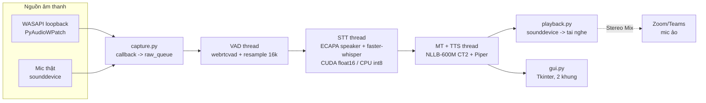

# Kiến trúc Windows vs macOS

Tài liệu so sánh kiến trúc **hiện tại trên Windows** (đã đọc từ code) với kiến trúc
**macOS** (đang hiện thực trên nhánh `macos`, số đo lấy từ spike thật). Mục đích: thấy rõ phần
nào dùng chung, phần nào phải viết lại, từ đó chọn hướng phát triển.

Phạm vi: nhánh `macos`. Máy đích: Apple Silicon (đã kiểm tra trên M2 Pro, 32GB, macOS 26).

---

## 1. Windows (hiện tại)



- Ba giai đoạn thread tách rời (`pipeline.py`): VAD, STT, MT+TTS. Mỗi chiều dịch là một `DirectionPipeline`, hai chiều dùng chung một `ModelHub`.
- Phần cứng tự dò (`hardware.py`): CUDA thì Whisper medium float16, không thì small/base int8.
- Chống vòng lặp: tự tắt thu khi đang đọc, và chọn output khác card với thiết bị đang loopback.
- Chiều Việt→Anh đi vào Zoom qua **Stereo Mix**, chỉ nghe được chính card của nó.

## 2. macOS

```mermaid
flowchart LR
  subgraph HELP[Swift helper - tiến trình riêng]
    TAP[Core Audio process tap<br/>loại trừ PID của Python]
  end
  subgraph IN[Nguồn âm thanh]
    MIC[Mic thật<br/>sounddevice / CoreAudio]
  end
  TAP -- pipe PCM float32 --> CAP
  MIC --> CAP
  CAP[macos/audio.py LoopbackCapture<br/>đọc pipe -> raw_queue] --> VAD[VAD thread<br/>giữ nguyên]
  VAD --> STT[STT thread<br/>ECAPA + backend theo nền tảng<br/>MLX (GPU Apple) / faster-whisper CPU]
  STT --> MT[MT + TTS thread<br/>NLLB CT2 CPU int8 + Piper<br/>giữ nguyên]
  MT --> PLAY[playback.py<br/>sounddevice -> CoreAudio]
  MT --> GUI[GUI<br/>Giai đoạn 1: Tkinter<br/>Giai đoạn 2: SwiftUI menu bar + phụ đề nổi]
  PLAY -. BlackHole .-> ZOOM[Zoom/Teams<br/>mic ảo]
```

Khác biệt kiến trúc quan trọng: **lớp bắt âm thanh chuyển ra ngoài tiến trình Python**
(Swift helper), vì Python không có API sạch cho Core Audio tap.

## 3. So sánh từng thành phần

| Thành phần | Windows (hiện tại) | macOS (đề xuất) | Mức thay đổi |
|---|---|---|---|
| Bắt âm thanh hệ thống | WASAPI loopback, `pyaudiowpatch` | Core Audio process tap qua Swift helper (dự phòng: ScreenCaptureKit) | **Viết mới** |
| Chống vòng lặp | Tách card, tự tắt thu khi đọc | Loại trừ PID Python khỏi tap | Đổi cơ chế, đơn giản hơn |
| Liệt kê / chọn thiết bị | Lọc host API WASAPI/DirectSound, so khớp card | CoreAudio qua `sounddevice`, không lọc host API | **Viết lại** |
| Mic thật | `sounddevice` | `sounddevice` | Giữ (bỏ lọc host API) |
| Phát ra tai nghe | `sounddevice` + fallback | `sounddevice` + fallback | Giữ |
| Mic ảo cho chiều Việt→Anh | Stereo Mix (có sẵn, gắn card) | BlackHole (phải cài) | Đổi, thêm bước cài |
| VAD | `webrtcvad-wheels` | Như cũ nếu có wheel arm64, không thì Silero VAD | Cần kiểm chứng |
| STT | `faster-whisper` CUDA/CPU | MLX-Whisper hoặc whisper.cpp (Metal); `faster-whisper` CPU làm dự phòng | **Thêm backend** |
| Nhận diện người nói | ECAPA (torch, CUDA/CPU) | ECAPA (torch, MPS/CPU) | Chỉnh nhỏ |
| Dịch | NLLB CT2 int8_float16 (GPU) | NLLB CT2 int8 (CPU) | Giữ, đo lại tốc độ |
| TTS | Piper (onnxruntime) | Piper (onnxruntime) | Giữ |
| Cắt câu, glossary, lọc ảo giác | Thuần Python | Thuần Python | Giữ nguyên |
| Pipeline 3 thread | `pipeline.py` | `pipeline.py` | Giữ nguyên |
| Dò phần cứng | CUDA hoặc CPU | CUDA, MLX hoặc CPU | Mở rộng `hardware.py` |
| Giao diện | Tkinter | Tkinter rồi SwiftUI | Giai đoạn 2 |
| Cài đặt / chạy | `CHAY_APP.bat`, `setup_env.py` | `setup_mac.sh`, `.command` | **Viết mới** |
| Quyền hệ thống | Không cần admin | Quyền ghi âm thanh hệ thống (TCC), quyền mic | Mới |

## 4. Cấu trúc thư mục và các ranh giới

Mô hình **adapter**: `app/` là lõi dùng chung, `windows/` và `macos/` ngang hàng, mỗi
bên cung cấp cùng một bộ module. Lõi không bao giờ import trực tiếp một nền tảng, chỉ đi
qua `app/platform_impl.py`.

```
main.py, setup_env.py, requirements-common.txt
app/                      lõi dùng chung (pipeline, VAD, STT, dịch, TTS, glossary, GUI)
  platform_impl.py        chọn windows/ hoặc macos/ theo sys.platform
  audio_types.py          LoopbackDevice / InputDevice / OutputDevice
  audio_devices.py        mic + thiết bị phát (sounddevice), loopback ủy quyền cho nền tảng
  capture.py              MicCapture + LoopbackCapture (từ nền tảng)
  accel.py                Accelerator + chính sách chọn backend theo phần cứng
  hardware.py             HardwareProfile = phần cứng nền tảng khai báo + accel.choose_plan
  stt.py                  bộ lọc ảo giác + chọn ngôn ngữ (dùng chung)
  stt_backends/           faster_whisper.py (CUDA/CPU) | mlx.py (GPU Apple)
windows/                  audio.py (WASAPI), levels.py, runtime.py (DLL CUDA),
                          hardware.py (CUDA), CHAY_APP.bat, requirements.txt
macos/                    audio.py (Core Audio tap), levels.py, runtime.py, hardware.py,
                          sysaudio-capture/ (Swift), build_helper.sh, setup_mac.sh,
                          run.command, bench/, requirements.txt
docs/
```

Giao diện mà mỗi gói nền tảng phải cung cấp:

| Module | Nội dung |
|---|---|
| `audio` | `HOST_APIS`, `GENERIC_ALIASES`, `PREFER_DEFAULT_OUTPUT`, `list_loopback_devices`, `get_default_loopback_device`, `is_same_physical_device`, `LoopbackCapture` |
| `levels` | `find_active_loopback`, `main` |
| `runtime` | `ensure_cuda_dlls` (macOS trả về True, không làm gì) |
| `hardware` | `detect_accelerators`, `total_ram_gb` |

Thêm nền tảng mới (hoặc bộ tăng tốc mới như Intel NPU) chỉ cần thêm một gói/backend, không
sửa lõi.

## 4b. Tăng tốc phần cứng (mục tiêu hiện tại: macOS trước)

Mỗi giai đoạn pipeline chọn bộ tăng tốc riêng (`app/accel.py`), không ép cả app vào một thiết bị.

| Giai đoạn | Windows | macOS (Apple Silicon) |
|---|---|---|
| STT | CUDA float16 (faster-whisper), CPU int8 nếu không có GPU | **GPU Apple qua MLX** (float16) |
| Dịch (NLLB) | CTranslate2 CUDA | CTranslate2 CPU int8 (đo tiếp) |
| Nhận diện người nói | torch CUDA | torch CPU |
| TTS (Piper) | CPU | CPU |
| NPU | Intel NPU: để sau | Neural Engine (Core ML): để sau |

Số đo thật trên M2 Pro 32GB, `macos/bench/bench_engine.py`, câu 4.6-5.1s:

| Model (MLX, GPU) | Suy luận / câu | Nhận diện ngôn ngữ | Ghi chú |
|---|---|---|---|
| small | 0.2s | 0.1s | Sai dấu tiếng Việt nhiều ("bộ nhớ đệm" → "bộ nhớ định", "tràn" → "chàn") |
| medium | 0.5-0.6s | 0.3s | "tràn" → "chán" |
| **large-v3-turbo** | 0.6s | 0.55s | Đúng "bị tràn"; **mặc định cho Mac từ 16GB RAM** |

Giới hạn còn lại: nhận diện ngôn ngữ (chế độ tự nhận diện) chạy encoder một lần riêng rồi
transcribe chạy lần nữa, tốn thêm ~0.5s với turbo. Có thể tái dùng đặc trưng encoder.

## 5. Rủi ro và điều chưa biết (cần spike)

| Rủi ro | Kết quả spike (2026-09-23, M2 Pro 32GB, macOS 26.6.2) |
|---|---|
| Core Audio tap bắt được âm thanh hệ thống | **Xác nhận.** `sysaudio-capture` (Swift, Core Audio process tap) bắt được audio thật khi chạy từ Terminal của người dùng: `rms=0.018, peak=0.156` trên 5s audio thật (trước đó `rms=0` khi loa tắt tiếng, đúng như kỳ vọng). |
| Quyền TCC gắn vào đâu | **Quan trọng, đổi cách làm.** macOS gán `kTCCServiceAudioCapture` cho tiến trình *chịu trách nhiệm* (app đã khởi chạy), không phải cho chính binary — dù đã đóng gói `.app` đúng chuẩn. Chạy từ trong Claude Code bị từ chối âm thầm vì Claude Code không khai báo `NSAudioCaptureUsageDescription`. Chạy trực tiếp từ Terminal của người dùng thì xin quyền và hoạt động bình thường. **Hệ quả cho thiết kế:** helper/app cuối phải được người dùng tự chạy hoặc double-click, không thể kiểm thử tự động từ môi trường CI/agent bên trong app khác. |
| MLX-Whisper so với `faster-whisper` CPU | **Đo xong.** Cùng model `small`, cùng câu 4.35s tiếng Anh: `faster-whisper` CPU int8 = 1.43s/câu; **MLX-Whisper (Metal GPU) = 0.23–0.28s/câu, nhanh hơn ~5-6 lần**. Cả hai ra đúng chữ. Kết luận: dùng MLX-Whisper làm backend STT chính trên Apple Silicon. |
| `webrtcvad-wheels` có wheel arm64 cho Python 3.12 | **Xác nhận có**, cài và `import` chạy tốt trên `python3.12` (Homebrew, arm64). |
| NLLB CT2 CPU int8 trên M2 Pro đạt độ trễ nào | Chưa đo — làm ở giai đoạn 1 khi ghép pipeline thật. |
| Loại trừ PID khỏi tap (chống vòng lặp) | Code đã có (`--exclude-pid`), chưa đo thực tế vì test phải chạy ngoài Terminal người dùng — làm cùng lúc với việc đóng gói `.app` ký thật ở giai đoạn 1. |
| BlackHole cho chiều Việt→Anh: người dùng cuối có chấp nhận cài thêm | Quyết định sản phẩm, chưa cần trả lời ở giai đoạn 0. |

**Ghi chú công cụ:** benchmark dùng `python3.12` (Homebrew) trong `.venv/`, không dùng Python 3.14 mặc định của máy (quá mới, một số wheel chưa có bản arm64). `ffmpeg` (Homebrew) cần cho `mlx-whisper` đọc audio.

## 6. Hướng phát triển

**Nguyên tắc:** giữ một engine Python dùng chung, chỉ tách phần đụng hệ điều hành.

1. **Giai đoạn 0, spike.** Trả lời các rủi ro ở mục 5. Kết quả là bảng số đo thật.
2. **Giai đoạn 1, port engine.** Tách `platform/`, thêm `SttBackend`, viết `setup_mac.sh`. Mốc: `python main.py --watch` dịch được video đang xem trên Mac.
3. **Giai đoạn 2, giao diện Mac.** SwiftUI menu bar và phụ đề nổi luôn trên cùng. Nói chuyện với engine qua socket cục bộ (JSON lines).
4. **Giai đoạn 3, đóng gói (tuỳ chọn).** `.app` có ký số và notarize, nhúng Python và helper.

Hướng bị loại: viết lại toàn bộ bằng Swift. Giọng Piper tiếng Việt, NLLB và ECAPA đều
thuộc hệ Python/ONNX nên chi phí cao mà không có lợi rõ ràng.

**Cập nhật sau spike:** hai quyết định kỹ thuật đã chốt bằng số đo thật thay vì suy đoán:
- STT dùng **MLX-Whisper** làm backend chính trên Apple Silicon (nhanh hơn CPU int8 khoảng 5-6 lần).
- Vì giới hạn quyền TCC (mục 5), việc kiểm thử helper bắt âm thanh và đóng gói cuối cùng
  phải làm qua `.app` ký thật, người dùng tự chạy — không kiểm thử được từ môi trường
  agent/CI chạy bên trong ứng dụng khác. Cần đưa bước "ký + chạy thử thủ công" vào ngay
  đầu giai đoạn 1, thay vì để cuối.
